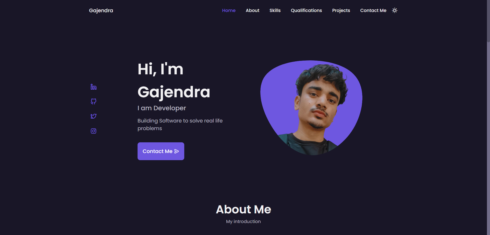

<h1>Personal Portfolio Website - v0.1</h1>

<h2>
  <a href="">Gajendra Ingle</a>
</h2>

  

 

⭐ Star this repo on GitHub — it helps!

## Features 📋

⚡️ Fully Responsive\
⚡️ Valid HTML5 & CSS3\
⚡️ Typing animation\
⚡️ Functional Contact Form

## Sections 📚

✔️ Home\
✔️ About\
✔️ Skills \
✔️ Qualifications \
✔️ Projects\
✔️ Contact Me\
✔️ Footer

To view a live example, **[click here](https://gajendra-ingle.netlify.app/)**
